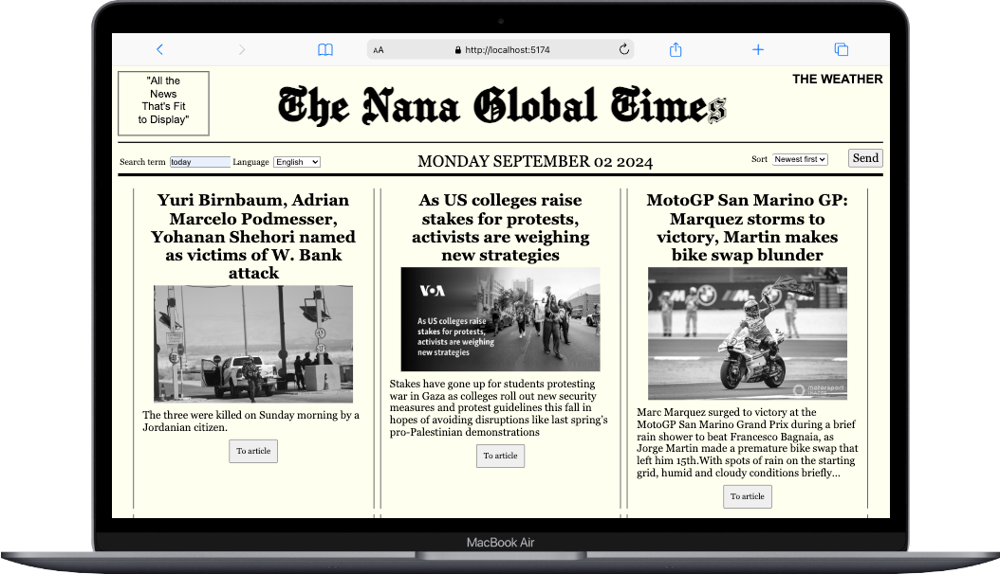

# The Nana Global Times

coded using https://newsapi.org/

---

  

 

## About

This is one of the projects I've coded during my journey of learning typescript.

I imitated the look of the most popular Newspapers of all times - The New York Times.

### Future Plans for this project:

- adding media queries for different disply sizes
- checking why the Chomsky font doen't display "s" propperly
- making the date functional, so it can be also used to serch for a specific date
- adding a weather API that shows the weather current weather of your location and/or of the date and location selected

---

Deployed:
